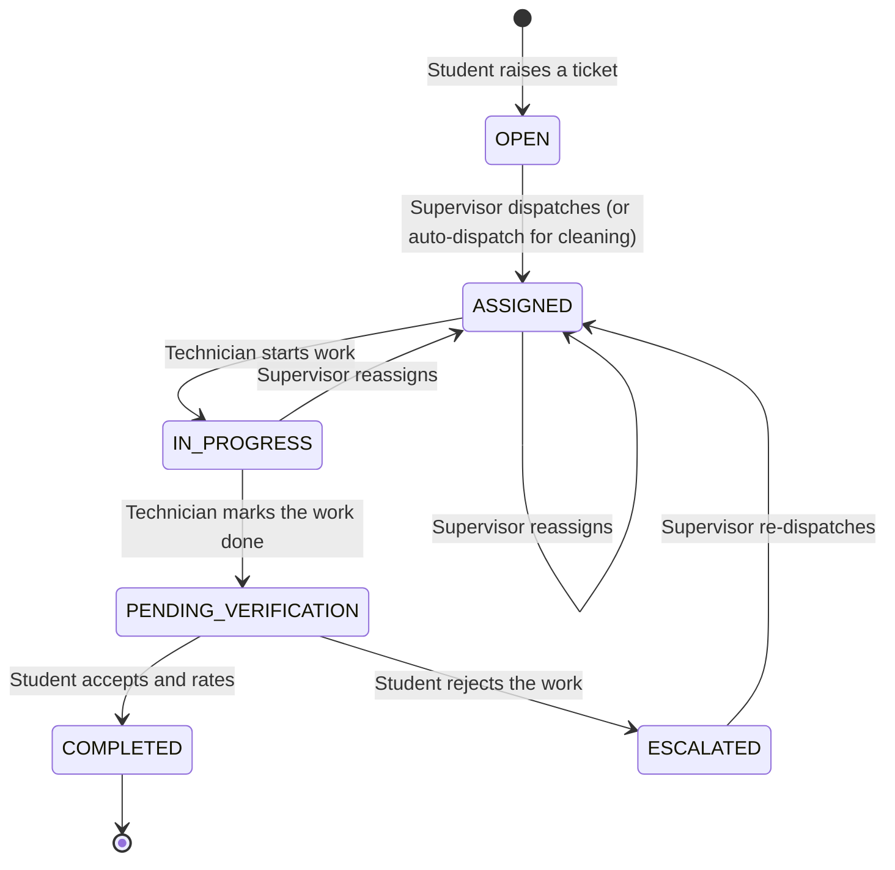
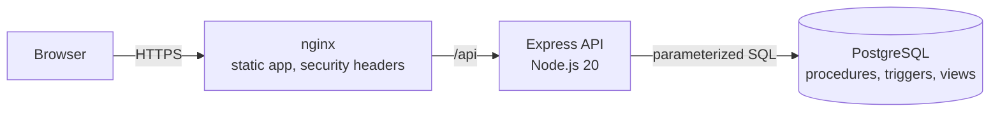

<div align="center">


# FixMaster

**Hostel facilities management and maintenance service desk**

Students report a fault once. FixMaster routes it to the right technician, orders their
work floor by floor, and closes the ticket only after the student confirms the fix.

[](https://github.com/Divyakush2006/FixMaster/actions/workflows/ci.yml)


</div>

---

## Contents

- [Overview](#overview)
- [Features](#features)
- [Ticket lifecycle](#ticket-lifecycle)
- [Architecture](#architecture)
- [Getting started](#getting-started)
- [Configuration](#configuration)
- [Database](#database)
- [API overview](#api-overview)
- [Security](#security)
- [Quality and testing](#quality-and-testing)
- [Project structure](#project-structure)
- [Documentation](#documentation)
- [Academic context](#academic-context)

## Overview

FixMaster replaces paper complaint registers in university hostels with a single,
auditable service desk. It is built for VIT Vellore's hostel blocks (A to T) and covers
the whole loop: intake, dispatch, on-site work, student verification and analytics.

| Problem in a paper-based process | How FixMaster handles it |
|---|---|
| Complaints get lost and nobody can see their status | Every ticket has a reference (`TKT-xxxxxx`), a live status and a full history |
| Technicians criss-cross a building between floors | Each technician's queue is ordered by floor, then priority |
| Work is marked done without the resident agreeing | Only the student who raised a ticket can close it; a rejection sends it back for rework |
| Supervisors cannot see recurring failures | Dashboards show open work, escalations and repeat-fault hotspots |
| No record of who changed what | Ticket history plus an append-only audit log of administrative actions |

## Features

**Students**
- Register and sign in with their registration number.
- Raise a ticket for their room or a common area, choosing from 6 categories and 25 issue types.
- Priority defaults from the issue type; a student can raise it by at most one level.
- Follow each ticket on a timeline, then accept the fix with a rating or reject it.

**Technicians**
- A work queue ordered by floor, then priority.
- Start a job, mark it done with a note, and set availability (on or off duty).

**Supervisors**
- A dashboard of key figures, a searchable and filterable ticket register, and an escalation queue.
- Dispatch tickets to a technician or reassign them. Cleaning requests can be auto-dispatched.
- Hotspots: locations with recurring faults.

**Administrators** (separate sign-in at `/admin`, shorter sessions)
- Users and access: create accounts, deactivate or reactivate them, unlock locked accounts and reset passwords.
- Room allotments, with live room occupancy.
- Infrastructure: blocks, floors and rooms, with floor-based numbering (`G01`, `428`).
- Audit log of every administrative change.

**Across the product**
- Responsive interface that works on phones for students and technicians.
- Meets WCAG 2.1 AA accessibility.
- Signs users out after a period of inactivity, and signing out in one tab signs out every tab.

## Ticket lifecycle



The database enforces these rules, not just the interface. Ticket transitions run inside
stored procedures that lock the row, and a trigger writes every status change to the
ticket's history.

## Architecture



| Layer | Technology |
|---|---|
| Web app | React 18, TypeScript, Vite, Tailwind CSS, TanStack Query, React Hook Form + Zod, Recharts |
| API | Node.js 20+, Express 5, express-validator, Helmet, express-rate-limit, JSON Web Tokens, bcrypt |
| Database | PostgreSQL 15 / 16: stored procedures, triggers and views; versioned, checksummed migrations |
| Delivery | Docker images for the API and the web tier (nginx), Docker Compose, GitHub Actions CI |

The API talks to PostgreSQL through `pg` with parameterized queries; there is no ORM. The
business rules live in the database (`database/migrations/003_programmable_objects.sql` and
`006_dispatch_reassignment.sql`), so they hold no matter which client writes the data.

## Getting started

### Prerequisites

- Node.js 20 or newer (22 recommended)
- PostgreSQL 15 or newer, **or** Docker Desktop

### Run locally

```bash
git clone https://github.com/Divyakush2006/FixMaster.git
cd FixMaster

cp .env.example .env              # defaults point at a local PostgreSQL
npm ci
npm run db:migrate                # create or upgrade the schema
npm run db:seed                   # load the VIT L-Block demo dataset
npm run dev                       # API on http://localhost:5000

cd client
npm ci
npm run dev                       # web app on http://localhost:3000
```

Open http://localhost:3000/login for students and staff, or http://localhost:3000/admin
for administrators.

### Demo accounts

Every seeded account uses the password `Password@123`.

| Role | Sign-in ID | Portal |
|---|---|---|
| Student | `21BCE0843` | `/login` → Student |
| Technician (electrician) | `EMP_ELEC_01` | `/login` → Staff |
| Supervisor (L-Block) | `SUP_LBLOCK_01` | `/login` → Staff |
| Administrator | `ADMIN_ESTATES_01` | `/admin` |

More seeded students (`21BCE1042`, `21BCE1523`, `22BCE0190`) and technicians
(`EMP_PLB_01`, `EMP_CARP_01`, `EMP_AC_01`, `EMP_CLN_01`, `EMP_CLN_02`) are available.

> The demo password and the example `JWT_SECRET` are for local development only. In
> production the API refuses to start with the example secret.

### Run with Docker

```bash
cp .env.example .env    # set JWT_SECRET (32+ random characters), POSTGRES_PASSWORD and CORS_ORIGIN
docker compose up -d --build
```

The app is served on http://localhost:8080. The API container applies pending migrations
on start. To load demo data, run the one-shot `seed` service (`docker compose --profile demo run --rm seed`).

## Configuration

All settings live in `.env`; see [`.env.example`](.env.example) for the full,
commented list. Only `DATABASE_URL` and `JWT_SECRET` are required.

| Variable | Purpose | Default |
|---|---|---|
| `DATABASE_URL` | PostgreSQL connection string (TLS is enabled automatically for managed providers such as Neon) | local `fix_master_db` |
| `JWT_SECRET` | Signing key for session tokens; must be strong in production | example value |
| `JWT_EXPIRES_IN` / `JWT_ADMIN_EXPIRES_IN` | Session length for users and administrators | `24h` / `8h` |
| `CORS_ORIGIN` | Allowed web origin; required in production | none |
| `TRUST_PROXY` | Set when running behind a reverse proxy | off |
| `LOGIN_LOCKOUT_THRESHOLD` / `LOGIN_LOCKOUT_MINUTES` | Account lockout after repeated failed sign-ins | `10` / `15` |
| `RATE_LIMIT_*` | Request limits per user, per account and per IP | see `.env.example` |

## Database

**15 tables.** The 11 core tables cover blocks, rooms, common areas, users, allotments,
complaint categories and sub-categories, complaints, assignments, feedback and ticket
logs. Four operational tables support them: `block_floors`, `audit_log`,
`revoked_tokens` and `schema_migrations`. All users share one `users` table with a
`role` column (role-based access control).

**Programmable objects.** Stored procedures handle dispatch and reassignment, resolution
confirmation and cleaning auto-dispatch. Triggers write the ticket audit trail, maintain
timestamps and keep floor counts in sync. Views produce the technician queue, the
supervisor summary and recurring-defect alerts.

| Command | What it does |
|---|---|
| `npm run db:migrate` | Apply pending migrations; refuses to run if an applied migration was edited |
| `npm run db:seed` | Load the demo dataset |
| `npm run db:reset -- --yes` | Drop and rebuild a **development** database |
| `npm run db:bundle` | Regenerate `database/schema.sql` and `triggers_procedures.sql` from the migrations |
| `database/backup_restore.sh backup` | `pg_dump` backup (PowerShell: `backup_restore.ps1`) |
| `database/backup_restore.sh restore <file>` | `pg_restore` from a backup |

> Never run `database/init_all.sql` against a database you want to keep: it drops every table.

## API overview

All endpoints are under `/api`. Responses are JSON, and list endpoints page with
`limit` / `offset` and return the total in the `X-Total-Count` header.

| Area | Base path | Who |
|---|---|---|
| Authentication | `/api/auth` (student register and login, staff login, admin login, logout) | Public / signed in |
| Tickets | `/api/complaints` | Students (own tickets), supervisors, administrators |
| Dispatch and work queue | `/api/dispatch` | Supervisors (assign, auto-dispatch), technicians (queue, start, done) |
| Verification | `/api/feedback` | The student who raised the ticket |
| Analytics | `/api/analytics` (KPIs, hotspots) | Supervisors, administrators |
| Reference data | `/api/meta` (blocks, floors, rooms, categories, staff) | Signed in |
| Own account | `/api/me` (profile, allotment, password, availability) | Signed in |
| Administration | `/api/admin` (users, allotments, blocks, floors, rooms, audit log) | Administrators |
| Health | `/api/health`, `/api/health/live` | Public |

## Security

- **Separate sign-in portals** for students, staff and administrators. Each token is bound
  to its portal, and administrator sessions are shorter.
- **Server-side sign-out.** Every token has a unique id and is revoked on sign-out; a
  password change invalidates all older sessions.
- **Brute-force protection.** Accounts lock after 10 consecutive failed sign-ins, and rate
  limits are counted per account, per user and per IP.
- **Password policy.** At least 8 characters with a letter and a digit, not a common
  password, and not containing the account ID. Passwords are stored as bcrypt hashes.
- **Authorization checks on every request.** Role checks, ownership checks on tickets,
  and validation of all input. Every query is parameterized.
- **Web tier hardening.** Content Security Policy, HSTS, `X-Frame-Options: DENY` and
  `nosniff`; the API uses Helmet and refuses weak production configuration.
- **Accountability.** An append-only audit log records each administrative action with the
  actor, target, IP address and request id.

Known limitations and recommended next steps are listed in
[Production Readiness](docs/PRODUCTION_READINESS.md#not-done--accepted-risks-and-decisions-for-the-team).

## Quality and testing

```bash
npm test                 # API and database tests (uses a separate fix_master_test database)
cd client && npm test    # web app unit tests
```

| Check | Result |
|---|---|
| API and database tests (Node test runner, real PostgreSQL) | 87 passing |
| Web unit tests (Vitest) | 26 passing |
| Security probe of the running system (auth, authorization, injection, races, brute force) | 39 / 39 |
| Accessibility (axe-core, WCAG 2.1 AA) | 21 / 21 screens, 0 violations |
| Load (50 concurrent connections) | About 600 authenticated req/s, p99 about 120 ms, 0 errors |
| Dependency audit (shipped dependencies) | 0 known vulnerabilities |

CI runs on every push and pull request to `main` and `dev`:

- **API:** the test suite against PostgreSQL 15 and 16, plus a dependency audit.
- **Web:** type-checking, tests and a production build.
- **Docker:** builds the full Compose stack and smoke-tests it through nginx.

## Project structure

```
.
├── src/                    Express API: routes, controllers, middleware, services
├── database/
│   ├── migrations/         Versioned schema, procedures, triggers and views
│   ├── seed_data.sql       Demo dataset (VIT L-Block)
│   └── backup_restore.*    pg_dump / pg_restore scripts
├── scripts/                Migrate, seed, reset and bundle tools
├── tests/                  API and database test suites
├── client/                 React web app (Vite) and its nginx config
│   └── src/
│       ├── features/       Screens by portal: student, staff, supervisor, admin
│       ├── components/     Design system and application shell
│       └── api/            Typed API client and session handling
├── docs/                   Design, audit and academic documentation
├── Dockerfile              API image
├── docker-compose.yml      db, api, web and seed services
└── .github/workflows/      CI pipeline
```

## Documentation

| Document | Contents |
|---|---|
| [Production Readiness](docs/PRODUCTION_READINESS.md) | Security audit, fixes, verification evidence and known limitations |
| [Bug Fix Log](docs/BUGFIXES.md) | Defects found and how they were fixed |
| [Frontend Notes](FRONTEND_NOTES.md) | Screens, routes and frontend conventions |
| [Database Implementation](docs/database_implementation.md) | DDL, joins, aggregates, triggers, procedures and views |
| [ER Diagrams](docs/er_diagrams.md) | Entity-relationship models and normalization proofs |
| [User Types](docs/user_types.md) | Roles and the permissions matrix |
| [Complaint Types](docs/complaint_types.md) | Categories, issue types and service-level targets |
| [Implementation Guide](docs/IMPLEMENTATION_GUIDE.md) | Team implementation guide |
| [Backend Handover Report](docs/BACKEND_HANDOVER_REPORT.md) | Backend engineering handover |

## Academic context

FixMaster was built for **BCSE307L, Database Systems** (B.Tech, Fall Semester 2026-27),
School of Computer Science and Engineering (SCOPE), VIT Vellore, under Dr. Deepika J.
The rubric-by-rubric mapping (problem statement, ER design, normalization, SQL
implementation, security and professional practices) is in the
[Academic Report](docs/ACADEMIC_REPORT.md).
